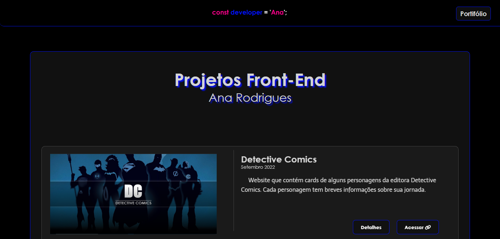
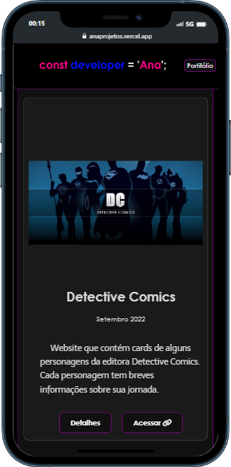
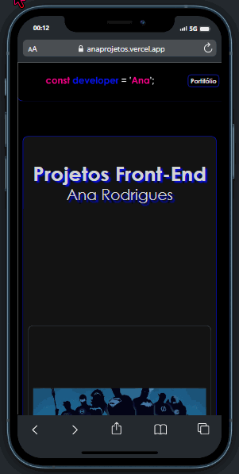

# 🚀 Projetos desenvolvidos

#### ⭐ Este website foi desenvolvido por mim com o intuito de apresentar todos os projetos que desenvolvi até hoje. O site sempre está atualizado, contendo desde os projetos mais antigos até os mais recentes.  

### 📌  Você pode acessar o site clicando <a href= "https://anaprojetos.vercel.app/"> AQUI </a>
#### - ou dar uma olhadinha nos gifs do projeto, ao final do readme. <3  

## 🌟  Conteúdo 

#### 🌠 Dentro do website você irá encontrar todos os meus projetos, onde está disponibilizado o acesso para cada um deles.  Cada projeto possui uma descrição prévia do que se encontra nele. Também é possível exibir detalhes do desenvolvimento, como tecnologias utilizadas, nivel de dificuldade, tempo de desenvolvimento e outros.  

## 💢 Demonstração
#### - Página inicial
 
 

#### - Responsividade (Iphone 12 PRO)

 

#### ⚡ estou aberta a opiniões construtivas, dicas e ideias.
## - Obrigada por ler até aqui! 💗
